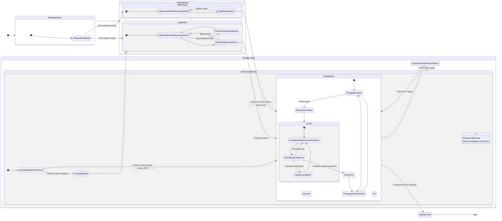

<mermaid_diagram>

```mermaid
stateDiagram-v2
    direction LR
    [*] --> Niezalogowany

    state Niezalogowany {
        [*] --> OdkrywanieAplikacji
        OdkrywanieAplikacji --> Logowanie : Chce zagrać w grę
        OdkrywanieAplikacji --> Rejestracja : Chce utworzyć konto
    }

    state Autentykacja {
        direction TD
        state Logowanie {
            [*] --> WprowadzanieDanychLogowania
            WprowadzanieDanychLogowania --> WeryfikacjaPoswiadczen <<choice>>
            WeryfikacjaPoswiadczen --> Zalogowany : Poprawne dane
            WeryfikacjaPoswiadczen --> WprowadzanieDanychLogowania : Błędne dane
            WprowadzanieDanychLogowania --> ProcesOdzyskiwaniaHasla : Zapomniałem hasła
            ProcesOdzyskiwaniaHasla --> WprowadzanieDanychLogowania
        }
        state Rejestracja {
            [*] --> WprowadzanieDanychRejestracji
            WprowadzanieDanychRejestracji --> WalidacjaDanych <<choice>>
            WalidacjaDanych --> Zalogowany : Poprawne dane (konto utworzone)
            WalidacjaDanych --> WprowadzanieDanychRejestracji : Błędne dane
        }
    }

%%    note right of Autentykacja: US-006: Po pomyślnej rejestracji<br>użytkownik jest automatycznie logowany

    Niezalogowany --> Autentykacja

    state Zalogowany {
        direction TD
        [*] --> PrzegladanieGier
        PrzegladanieGier --> RozpoczynanieGry : Wybiera grę
        RozpoczynanieGry --> Granie
        state Granie {
            [*] --> OczekiwanieNaZaliczenieZadania
            OczekiwanieNaZaliczenieZadania --> WeryfikacjaLokalizacji <<choice>> : Przesyła lokalizację
            WeryfikacjaLokalizacji --> OczekiwanieNaZaliczenieZadania : Zła lokalizacja
            WeryfikacjaLokalizacji --> NastepneZadanie : Poprawna lokalizacja
            NastepneZadanie --> OczekiwanieNaZaliczenieZadania
            WeryfikacjaLokalizacji --> KoniecGry : Ostatnie zadanie zaliczone
        }
        KoniecGry --> PrzegladanieHistoriiGier
        PrzegladanieGier --> PrzegladanieHistoriiGier
        PrzegladanieHistoriiGier --> PrzegladanieGier
    }

    Zalogowany --> Wylogowanie : Użytkownik klika "Wyloguj"
    Wylogowanie --> [*]

    state "Obsługa Sesji" as Sesja {
        Zalogowany --> SprawdzenieWaznosciTokena <<choice>> : Akcja wymagająca autoryzacji
        SprawdzenieWaznosciTokena --> Zalogowany : Token JWT ważny
        SprawdzenieWaznosciTokena --> OdswiezanieSesji : Token JWT wygasł
        state OdswiezanieSesji {
            [*] --> WeryfikacjaRefreshTokena <<choice>>
            WeryfikacjaRefreshTokena --> Zalogowany : Refresh Token ważny (nowy JWT)
            WeryfikacjaRefreshTokena --> SesjaWygasla : Refresh Token nieważny
        }
    }
    SesjaWygasla --> Logowanie
```
</mermaid_diagram>