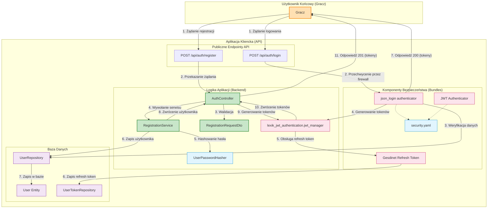

<mermaid_diagram>

```mermaid
flowchart TD
    classDef newComponent fill:#c8e6c9,stroke:#388e3c,stroke-width:2px;
    classDef backend fill:#e1f5fe,stroke:#0288d1,stroke-width:1px;
    classDef securityBundle fill:#fce4ec,stroke:#c2185b,stroke-width:1px;
    classDef database fill:#f3e5f5,stroke:#7b1fa2,stroke-width:1px;
    classDef actor fill:#ffe0b2,stroke:#f57c00,stroke-width:2px;

    subgraph "Użytkownik Końcowy (Gracz)"
        direction LR
        User[Gracz]:::actor
    end

    subgraph "Aplikacja Kliencka (API)"
        subgraph "Publiczne Endpointy API"
            RegisterEP["POST /api/auth/register"]
            LoginEP["POST /api/auth/login"]
        end

        subgraph "Logika Aplikacji (Backend)"
            AuthController[AuthController]:::newComponent
            RegistrationService[RegistrationService]:::newComponent
            RegistrationDTO[RegistrationRequestDto]:::newComponent
            UserPasswordHasher[UserPasswordHasher]:::backend
            JWTManager["lexik_jwt_authentication.jwt_manager"]:::securityBundle
        end

        subgraph "Komponenty Bezpieczeństwa (Bundles)"
            JsonLoginAuth["json_login authenticator"]:::securityBundle
            JwtAuth["JWT Authenticator"]:::securityBundle
            RefreshToken["Gesdinet Refresh Token"]:::securityBundle
            SecurityConfig["security.yaml"]:::backend
        end

        subgraph "Baza Danych"
            UserRepo[UserRepository]:::database
            UserEntity[User Entity]:::database
            UserTokenRepo[UserTokenRepository]:::database
        end
    end

    %% Przepływ Rejestracji Gracza
    User -- "1. Żądanie rejestracji" --> RegisterEP
    RegisterEP -- "2. Przekazanie żądania" --> AuthController
    AuthController -- "3. Walidacja" --> RegistrationDTO
    AuthController -- "4. Wywołanie serwisu" --> RegistrationService
    RegistrationService -- "5. Hashowanie hasła" --> UserPasswordHasher
    RegistrationService -- "6. Zapis użytkownika" --> UserRepo
    UserRepo -- "7. Zapis w bazie" --> UserEntity
    RegistrationService -- "8. Zwrócenie użytkownika" --> AuthController
    AuthController -- "9. Generowanie tokenów" --> JWTManager
    JWTManager -- "10. Zwrócenie tokenów" --> AuthController
    AuthController -- "11. Odpowiedź 201 (tokeny)" --> User

    %% Przepływ Logowania Gracza
    User -- "1. Żądanie logowania" --> LoginEP
    LoginEP -- "2. Przechwycenie przez firewall" --> JsonLoginAuth
    JsonLoginAuth -- "3. Weryfikacja danych" --> UserRepo
    JsonLoginAuth -- "4. Generowanie tokenów" --> JWTManager
    JWTManager -- "5. Obsługa refresh token" --> RefreshToken
    RefreshToken -- "6. Zapis refresh token" --> UserTokenRepo
    JsonLoginAuth -- "7. Odpowiedź 200 (tokeny)" --> User

    %% Zależności konfiguracyjne
    JsonLoginAuth -.-> SecurityConfig
    JwtAuth -.-> SecurityConfig
```
</mermaid_diagram>